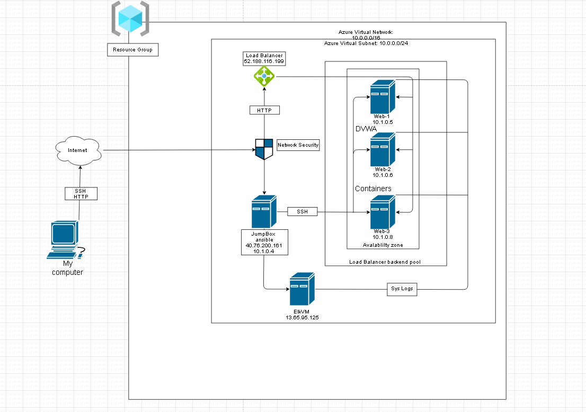

## Automated ELK Stack Deployment

The files in this repository were used to configure the network depicted below.

These files have been tested and used to generate a live ELK deployment on Azure. They can be used to either recreate the entire deployment pictured above. Alternatively, select portions of the Filebeat-playbook.yml file may be used to install only certain pieces of it, such as Filebeat.

![Playbook file] (Resources/filebeat-playbook.yml)

This document contains the following details:
- Description of the Topologu
- Access Policies
- ELK Configuration
  - Beats in Use
  - Machines Being Monitored
- How to Use the Ansible Build

### Description of the Topology

The main purpose of this network is to expose a load-balanced and monitored instance of DVWA, the D*mn Vulnerable Web Application.

Load balancing ensures that the application will be highly redundant, in addition to restricting access to the network.

Integrating an ELK server allows users to easily monitor the vulnerable VMs for changes to the logs and system metrics.

The configuration details of each machine may be found below.
_Note: Use the [Markdown Table Generator](http://www.tablesgenerator.com/markdown_tables) to add/remove values from the table_.

| Name     | Function | IP Address | Operating System |
|----------|----------|------------|------------------|
| Jump Box | Gateway  | 10.1.0.4   | Linux            |
| Web-1    | DVWA     | 10.1.0.5   | Linux            |
| Web-2    | DVWA     | 10.1.0.6   | Linux            |
| web-3    | DVWA     | 10.1.0.8   | Linux            |
| Elk-VM   | Elk      | 10.0.0.4   | Linux            |

### Access Policies

The machines on the internal network are not exposed to the public Internet. 

Only the Jumpbox machine can accept connections from the Internet. Access to this machine is only allowed from the following IP addresses:
73.151.160.24

Machines within the network can only be accessed by Jump Box.

A summary of the access policies in place can be found in the table below.

| Name     | Publicly Accessible | Allowed IP Address |
|----------|---------------------|--------------------|
| Jump Box | yes/no              | 73.151.160.24      |
| Web-1    | no                  | 10.1.0.4           |
| Web-2    | no                  | 10.1.0.4           |
| web-3    | no                  | 10.1.0.4           |
| Elk-VM   | yes                 | *                  |

### Elk Configuration

Ansible was used to automate configuration of the ELK machine. No configuration was performed manually, which is advantageous because it allows easy configuration management on all VM's.

The playbook implements the following tasks:
- Install docker.io
- Install python
- Install Virtual memory
- Launch docker elk container 

The following screenshot displays the result of running `docker ps` after successfully configuring the ELK instance.

### Target Machines & Beats
This ELK server is configured to monitor the following machines:
- 10.1.0.5
- 10.1.0.6
- 10.1.0.8

We have installed the following Beats on these machines:
- 10.0.0.4

These Beats allow us to collect the following information from each machine:
- filebeat collects log events and monitors the log files.

### Using the Playbook
In order to use the playbook, you will need to have an Ansible control node already configured. Assuming you have such a control node provisioned: 

SSH into the control node and follow the steps below:
- Copy the filebeat-config.yml file to /etc/ansible/files.
- Update the config file to include the ELK machines IP address.
- Run the playbook, and navigate to Kibana to check that the installation worked as expected.

_TODO: Answer the following questions to fill in the blanks:_
- The playbook file is filebeat-playbook.yml and is copied to the filebeat directory in etc.
- You must update the config file to ensure Ansible will run on the desired machine. When installing the Elk server it must be specified with the host name in the playbook but when installing Filebeat its specified through the IP specified in the config file. 
- The URL to navigate to verify the server is working is http://13.66.15.82:5601/app/kibana

_As a **Bonus**, provide the specific commands the user will need to run to download the playbook, update the files, etc._